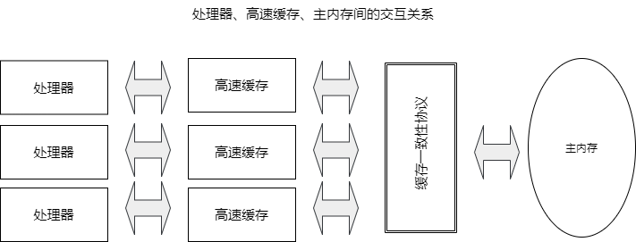
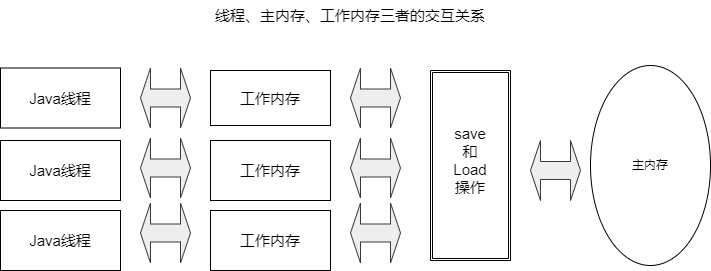

# 高效并发

## Java 内存模型与线程

并发处理的广泛应用是 Amdahl 定律取代摩尔定律成为计算机性能发展源动力的根本原因。

### 概述

让计算机同时去做几件事情，一个很重要的原因是计算机的运算速度与它的存储和通信子系统的速度差距太大，大量的时间都被花费在磁盘I/O、网络通信或者数据库访问上。

衡量一个服务性能的高低好坏，TPS(Transactions Per Second，每秒事务数)是重要的指标，它代表一秒内服务器能响应的请求总数，TPS 值与程序的并发能力又有非常密切的关系。对于计算量相同的任务，程序线程并发协调得越有条不紊，效率自然就会越高；反之，线程之间频繁争用数据，互相阻塞，甚至死锁，将会大大降低程序的并发能力。

无论语言、中间件和框架再如何先进，开发人员都不应期望它们能独立完成所有并发处理的事情，了解并发的内幕仍然是成为一个高级程序员不可缺少的课程。

### 硬件效率与一致性

物理机遇到的并发问题与虚拟机中的情况有很多相似之处，物理机对并发的处理方案对虚拟机的实现也有相当大的参考意义。

"让计算机并发执行若干个运算任务" 与 "更充分的领用计算机处理器的效能" 之间的因果关系并没有想象中的简单，其中的重要的复杂性是绝大多数的运算任务都不可能只靠处理器"计算"就能完成。处理器至少要与内存交互，如读取运算数据、存储运算结果等，这个 I/O 操作是很难消除的(无法仅靠寄存器来完成所有的运算任务)。由于计算机的存储设备与处理器的运算速度有着几个数量级的差距，所以现代计算机系统都不得不加入一层或者多层读写速度尽可能接近处理器运算速度的高速缓存来作为内存与处理器之间的缓冲：将运算需要使用的数据复制到告诉缓存中，让运算能快速进行，当运算结果结束后再从缓存同步回内存之中，这样处理器就无需等待缓慢的内存读写了。

基于高速缓存的存储交互很好的解决了处理器与内存速度之间的矛盾，但是也为计算机系统带来更高的复杂度：缓存一致性(Cache Coherence)。在多路处理器系统中，每个处理器都有自己的高速缓存，而它们又共享同一主内存，这种系统称为共享内存多核系统(Shared Memory Multiprocessors System)，如图所示：

当多个处理器的运算任务都设计同一块主内存区域，将可能导致各自的缓存数据不一致。如果真的发生这种情况，那同步回到主内存时该以谁的缓存数据为准呢？为了解决一致性问题，需要各个处理器访问缓存时都遵循一些协议，在读写时要根据协议进行操作，这类协议有 MSI、MESI(Illinois Protocol)、MOSI、Synapse、Firefly及 Dragon Protocol等。内存模型可以理解为在特定的操作协议下，对特定的内存或者高速缓存进行读写访问的过程抽象。

除了高速缓存，处理器可能会对输入代码进行乱序执行优化。处理器会在计算之后将乱序执行的结果重组，保证该结果与顺序执行的结果是一致的，但不保证程序中各个语句计算的先后顺序与输入代码中的顺序一致，因此如果存在一个计算任务依赖另外一个计算任务的中间结果，那么其顺序性并不能靠代码的先后顺序来保证。与处理器的乱序执行优化类似，Java虚拟机的即时编译器中也有指令重排序(Instruction Reorder)优化。

### Java 内存模型

《Java虚拟机规范》中曾试图定义一种 “Java 内存模型”（Java Momory Model，JMM）来屏蔽各种硬件和操作系统的内存访问差异，以实现让 Java 程序在各种平台下都能达到一致性的内存访问效果。

::: tip
定义Java内存模型并非一件容易的事情，这个模型必须足够严谨，才能让 Java 的并发访问操作不会产生歧义；但是也必须定义得足够宽松，使得虚拟机的实现能有足够的自由空间去利用硬件的各种特性来获取更好的执行速度。经过漫长的验证与修补，直至 JDK5 (实现了 JSR-133)发布后，Java内存模型才终于成熟、完善起来。
:::

#### 主内存与工作内存

Java内存模型的主要目的是定义程序中的各种变量的访问规则，即关注在虚拟机中把变量值存储到内存和从内存中取出变量值这样的底层细节。
::: tip
此处的变量包括了示例字段、静态字段和构成数组对象的元素，但是不包括局部变量与方法参数。
:::

**Java内存模型规定了所有的变量都储存在主内存中，每条线程还有自己的工作内存，线程的工作内存中保存了被该线程使用的变量的主内存副本，线程对变量的所有操作都必须在工作内存中进行，而不能直接读写主内存中的数据。不同的线程之间也无法直接访问工作内存中的变量，线程间变量值的传递均需要通过主内存来完成，线程、主内存、工作内存三者的交互关系如下图所示：**

::: warning
这里所讲的主内存、工作内存和Java内存区域中的Java堆、栈、方法区等并不是同一个层次的对内存的划分，这两者基本上是没有关系的。
如果硬要将两者勉强对应起来，那么从变量、主内存、工作内存的定义来看，主内存主要对应于 Java 堆中的对象实例数据部分，而工作内存则对应于虚拟机栈中的部分区域。从更基础的层次上说，主内存直接对应物理硬件的内存，而为了获取更好的运行速度，虚拟机可能会让工作内存优选存储于寄存器和告诉缓存中，因为程序运行时主要访问的是工作内存。
:::

#### 内存间的交互操作

关于主内存于工作内存之间的具体的交互协议，即一个变量如何从主内存拷贝到工作内存、如何从工作内存同步回主内存这一类的实现细节，Java内存模型中定义了8中操作来完成。Java虚拟机实现时必须保证下面提及的每一种操作都是原子的、不可再分的：

- lock：作用于主内存的变量，他把一个变量标识为一条线程独占的状态
- unlock：作用于主内存的变量，他把一个处于锁定状态的变量释放出来
- read：作用于主内存的变量，他把一个变量从主内存中传输至工作内存中
- load：作用于工作内存的变量，它把read操作从主内存得到的变量值放入工作内存的变量副本中
- use：作用于工作内存的变量，它把工作内存中的一个变量传递给执行引擎，每当虚拟机遇到一个需要使用变量的值的字节码指令时将会执行这个操作。
- assign：作用于工作内存的变量，它把一个从执行引擎得到的值赋给工作内存的变量，每当虚拟机遇到一个给变量赋值的字节码指令时执行这个操作。
- store：作用域工作内存的变量，它把工作内存的一个变量值传送到主内存中
- write：作用域主内存的变量，它把store操作从工作内存中得到的变量的值放入主内存的变量中。

如果要把一个变量从主内存拷贝到工作内存，那就要按顺序执行 read 和 load 操作，如果要把变量从工作内存同步回主内存，就需要按顺序执行 store 和 write 操作。除此之外，Java内存模型还规定了子执行上述8中基本操作时必须满足如下规则：

- 不允许 read 和 load、store 和 write 操作之一单独出现
- 不允许一个线程丢弃它最近的assign操作
- 不允许一个线程无原因地把数据从线程的工作内存同步回主内存中
- 一个新的变量只能在主内存中诞生，不允许在工作内存中直接使用一个未被初始化的变量
- 一个变量在同一时刻只允许一条线程对其进行lock操作，但lock操作可以被同一条线程重复执行多次，多次lock后，只有执行相同次数的unlock操作，变量才会解锁。
- 如果对一个变量执行lock操作，那将会清空工作内存中此变量的值
- 如果一个变量事先没有被 lock 锁定，那就不允许对它执行 unlock 操作，也不允许去 unlock 一个被其他线程锁定的变量。
- 对一个变量执行 unlock 操作之前，必须先把此变量同步回主内存中。